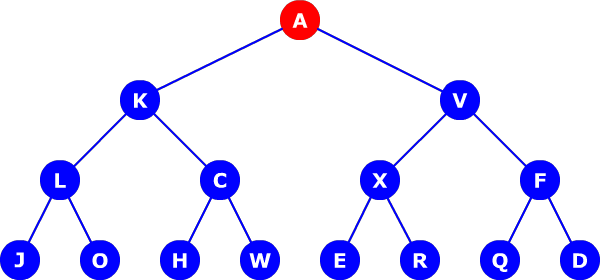
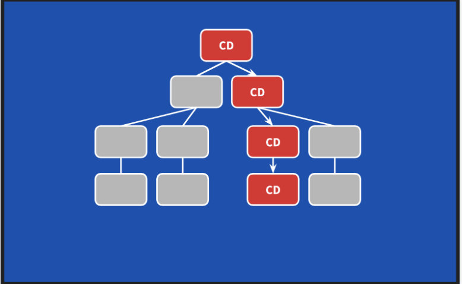
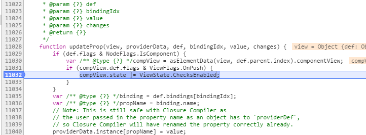
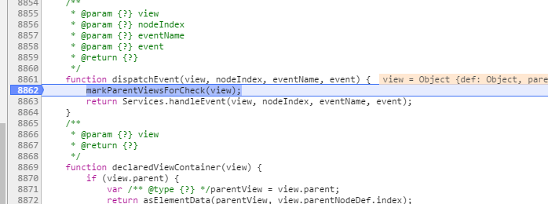

:::tip
了解 Angular 变更检测（ Change Detection ）可以帮助我们避免掉一些陷阱  
使用 OnPush 策略能够优化我们的应用，极大的提高应用的性能  
学习并理解它们可以让我们以优雅的方式构建出高效的应用
:::

<!-- more -->

本文目录如下：

- 什么是变更检测
- 什么时候会进行变更检测
- 变更检测是怎样进行的
- 使用 OnPush 策略优化应用
- 相关学习资源推荐

## 什么是变更检测

变更检测就是为了让应用的**状态**与**视图**保持一致的一种手段。

- 状态可以理解为 js 数据模型
- 视图就是用户界面，具体到某一个按钮、表单、文本

## 什么时候会进行变更检测

运行代码见 [Stackblitz ng-cd-demo1](https://stackblitz.com/edit/ng-cd-demo1)

```ts
@Component({
  selector: 'my-app',
  template: `
    <h1>Name change {{ name }}</h1>
    <p>Count: {{ count }}</p>
    <button (click)="changeName()">Change name</button>
  `,
})
export class AppComponent {
  name = 'Angular'
  private subject$ = new Subject<string>()

  private _count = 0 // 统计变更检测的次数
  get count() {
    console.log(`get count at ${new Date().getTime()}`)
    return this._count++
  }

  ngOnInit() {
    const myInterval = setInterval(() => {
      if (this._count > 10) {
        clearInterval(myInterval)

        // Interval 结束后 使用 subject 改变 Name
        this.subject$.next('subject name')
      }
    }, 1000)

    this.subject$.subscribe(name => {
      this.name = name
    })
  }

  // 点击按钮 改变 Name
  changeName() {
    this.name = 'change name'
  }
}
```

可以看到除了每次获取 count 的时候, `_count` 自增 1 之外，没有其他地方去操作它。  
程序运行结果是这样的：

- 每隔 1 秒钟 调用了 `get count()` 2 次，`_count` 自增 2。
- 5 秒钟后 `name` 被赋值为 `subject name`,调用了 `get count()` 两次，`_count` 自增 2。
- 如果最后点击 `button`, `name` 被赋值为 `change name`,调用了 `get count()` 两次，`_count` 自增 2。
- 每次变动，控制台都会报一个错，`ERROR Error: ExpressionChangedAfterItHasBeenCheckedError: Expression has changed after it was checked. Previous value: 'null: 0'. Current value: 'null: 1'.`

注：每次检测调用 2 次 ，然后两次结果对比不一致就会 `ExpressionChangedAfterItHasBeenCheckedError` ，在开发模式下才会出现，Production (生产) 模式下则只调用一次，也就不会报错,具体原因不再本文解释了，可以自行查阅相关资料。  
通过上面例子我们可以看出，当出现下面三种情况时，Angular 会进行变更检测（在示例中表现为 获取 `count` 值进行对比，导致 `_count` 自增）

- setInterval (setTimeout)
- click 事件 (submit keyUp...)
- rxjs stream (XHR 获取数据)

可以发现这些全都是异步操作，从而我们可以得知：**只要有异步操作的发生，Angular 就会进行变更检测**

## 变更检测是怎样进行的

### 核心：NgZone

你如果查阅过相关资料的话，就应该挺过一个大名鼎鼎的家伙叫做 `zone.js`,它被提议作为 TC39 的标准。  
而 Angular 有着自己的 zone, 叫做`NgZone`。`NgZone` 代理(monkey-patches)了 Angular 中所有的异步操作,每次异步操作结束后，会调用 `onTurnDone()`。
另外有一个叫做 `ApplicationRef` 的对象监听了 `onTurnDone`, 只要这个方法被调用，`ApplicationRef` 就执行 `tick()`,从而进行变更检测。

```ts
class ApplicationRef {
  constructor(private zone: NgZone) {
    this.zone.onTurnDone
      .subscribe(() => this.zone.run(() => this.tick());
  }
}
```

关于 `NgZone` 的更多内容可以查看这篇文章：[Zones in Angular](https://blog.thoughtram.io/angular/2016/02/01/zones-in-angular-2.html)

### 变更检测执行顺序

总所周知，Angular 应用是一个组件树，而每一个组件都有着它自己的**变更检测器（change detector）**，那么我们也可以认为有相应的一个变更检测树。数据的流向就是从这棵树的顶端流向低端。

- 示例代码见 [Stackblitz ng-cd-demo2](https://stackblitz.com/edit/ng-cd-demo2)
- 如下图所示： `ngDoCheck` 是一个**广度优先遍历**的树
  - 
- 如下图所示： `render` 是一个**深度优先遍历**的树
  - 

关于变更检测更详细的内容请看这篇文章：[Everything you need to know about change detection in Angular](https://blog.angularindepth.com/everything-you-need-to-know-about-change-detection-in-angular-8006c51d206f)

## 使用 OnPush 策略优化应用

通过上节内容我们可以知道，每次发生异步操作，Angular 都会检测所有的组件,尽管 Angular 已经处理得足够好，让它检测的速度很快。但是当我们遇到较为复杂的业务场景时，我们可能需要更快更高效的解决方案。
我们可不可以让 Angular 只对**状态发生改变**的那部分执行变更检检测呢？答案当然是肯定的，那就是使用 `OnPush` 策略。
当我们只有最底层的某一个组件发生变化时，它可以帮助我们做到如下图所示的检测路径：

- 

### 如何使用

```ts
@Component({
  selector: 'my-app',
  templateUrl: './my-app.component.html',
  styleUrls: ['./my-app.component.css'],
  // so easy 只要加上这一句就搞定了
  changeDetection: ChangeDetectionStrategy.OnPush,
})
export class MyAppComponent {}
```

但是假如你仅仅只这么做了的话，那么你的应用往往不能按你续期的那样工作了，我们把第一个例子的代码稍微改了一下。  
示例代码见 [Stackblitz ng-cd-demo3](https://stackblitz.com/edit/ng-cd-demo3)

```ts
// 主要改动如下
@Component({
  changeDetection: ChangeDetectionStrategy.OnPush,
})
export class AppComponent {
  constructor(private changeDetectorRef: ChangeDetectorRef) {}

  ngOnInit() {
    const myInterval = setInterval(() => {
      if (this._count > 10) {
        clearInterval(myInterval)

        // Interval 结束后 使用 subject 改变 Name
        this.subject$.next('subject name')
      } else {
        this.name = `setInterval ${this._count}`
      }
      // 如果想 预期的进行工作 请取消下一行代码的注释
      // this.changeDetectorRef.markForCheck()
    }, 1000)
  }
}
```

我们预期的程序运行效果是：

- 前 10s,`name` 不断的被更改为 `setInterval ${this._count}`， `_count` 每次自增 1
- 然后 `name` 被更改为 `subject name`,`_count` 自增 1
- 之后我们再点击按钮后，`name` 被更改为 `change name`,`_count` 自增 1

但是实际上的运行效果是：

- 只有点击按钮，`name` 被更改为 `change name`,`_count` 自增 1

也就是说，我们在第二节总结的三种触发变更检测的方式：`- setInterval (setTimeout) click 事件 (submit keyUp...) rxjs stream (XHR 获取数据)`.只有第 2 种依然有效，其他两种失效了。  
但是，当我们取消注释 `this.changeDetectorRef.markForCheck()` ,一切又恢复正常了。  
这又是为什么呢？请往下看。

### OnPush 策略改变了什么

首先我们得知道对于使用 `OnPush` 策略的组件来说， `ChecksEnabled` 在第一次检测过后会被禁用。这意味着在接下来的变更检测中， 这个组件的视图以及所有的子视图会被跳过。[Everything you need to know about change detection in Angular](https://blog.angularindepth.com/everything-you-need-to-know-about-change-detection-in-angular-8006c51d206f) 文章中有详细解释。  
所以，如果我们需要让 Angular 知道我们的 `OnPush` 组件状态发什了改变，就需要重新把 `ChecksEnabled` 启用。

### OnPush 策略的组件如何触发变更检测

来自[stackoverflow](https://stackoverflow.com/questions/42312075/change-detection-issue-why-is-this-changing-when-its-the-same-object-referen)

- `@Input` 属性发生改变

  - 

- 组件触发绑定事件

  - 

- 在组件中手动调用`ChangeDetectorRef.markForCheck()`

  - 上面的例子就是这么干的

- 使用 `async` 管道，它内部调用了`ChangeDetectorRef.markForCheck()`

  ```ts
  private _updateLatestValue(async: any, value: Object): void {
    if (async === this._obj) {
      this._latestValue = value;
      this._ref.markForCheck();
    }
  }
  ```

### markForCheck vs detectChanges

作为 `ChangeDetectorRef` 中最常用的两个方法，在很多情况下，使用 `markForCheck` 和 `detectChanges` 都能达到逾期更新视图的效果，那么我们该如何选择呢？  
首先我们得知道他们的区别：[stackoverflow](https://stackoverflow.com/questions/41364386/whats-the-difference-between-markforcheck-and-detectchanges)

- `markForCheck` 为 `OnPush` 而生，它就是专门配合 `OnPush` 策略的，在 `Default` 策略下没有使用意义。
- `markForCheck` 只是从当前组件向上移动到跟组件并在移动的同时，将组件状态更新为 `ChecksEnabled`

  ```ts
  export function markParentViewsForCheck(view: ViewData) {
    let currView: ViewData | null = view
    while (currView) {
      if (currView.def.flags & ViewFlags.OnPush) {
        currView.state |= ViewState.ChecksEnabled
      }
      currView = currView.viewContainerParent || currView.parent
    }
  }
  ```

- `detectChanges` 是对当前组件以及它的子组件执行一次变更检测,无论它们的 `ChecksEnabled` 是否启用。这意味着对当前组件视图的检查可能依然是禁用的并且组件在接下来的常规变更检测中不会被检查。

  ```ts
  @Injectable()
  export class ApplicationRef_ extends ApplicationRef {
    tick(): void {
      if (this._runningTick) {
        throw new Error('ApplicationRef.tick is called  recursively');
      }

      const scope = ApplicationRef_._tickScope();
      try {
        this._runningTick = true;
        this._views.forEach((view) => view.detectChanges());
        ...
      }
    }
  }
  ```

也就是说，它们的最大区别在于 `detectChanges` 实际触发变更检测，而 `markForCheck` 不会触发变化检测,只是把当前组件标记成需要被检测的状态。如果在一次调用栈中，执行了多次`detectChanges`,那么就会触发多次变更检测，而 `markForCheck` 则没有这个问题。

### 在实际项目中，建议的使用方式

示例代码见 [Stackblitz ng-cd-demo4](https://stackblitz.com/edit/ng-cd-demo4)

- 该示例模拟了我们在实际项目中最常见的一种情景： 通过 `Service + Rxjs` 的获取了数据，然后组件更新数据。

```ts
@Component({
  selector: 'app-on-push',
  template: `
    <nz-spin [nzTip]="spinTip" [nzSpinning]="isSpinning">
      <h2>OnPushComponent Number: {{ data?.randomNumber }}</h2>
      <br />
      <app-on-push-child [data]="data"></app-on-push-child>
      <br />
      <button (click)="changeNumber()">Change number</button>
    </nz-spin>
  `,
  changeDetection: ChangeDetectionStrategy.OnPush,
})
export class OnPushComponent {
  spinTip = ''
  isSpinning = false
  data: AppData = {}

  constructor(
    private appDataService: AppDataService,
    private changeDetectorRef: ChangeDetectorRef,
  ) {}

  changeNumber() {
    this.startSpin('正在查询,请稍候...')
    // 由于 changeNumber 是 click 事件触发。 所以这里不需要手动  markForCheck
    this.appDataService
      .getData()
      .pipe(
        finalize(() => {
          this.stopSpin()
          this.changeDetectorRef.markForCheck()
        }),
      )
      .subscribe(data => {
        this.data = data
      })
  }

  private startSpin(spinTip: string) {
    this.spinTip = spinTip
    this.isSpinning = true
  }

  private stopSpin() {
    this.isSpinning = false
  }
}
```

## 相关学习资源推荐

- [edu-angular-change-detection](https://danielwiehl.github.io/edu-angular-change-detection/): 可以帮助你更好的理解 `ChangeDetectorRef`
- [Zones in Angular](https://blog.thoughtram.io/angular/2016/02/01/zones-in-angular-2.html)
- [These 5 articles will make you an Angular Change Detection expert](https://blog.angularindepth.com/these-5-articles-will-make-you-an-angular-change-detection-expert-ed530d28930)

本文就是我在看了这些文章后的些许收获，之前对于**变更检测**和**OnPush 策略**中一些模棱两可/有疑惑的问题都在这些文章中得到了解决,在这里感谢这些作者的分享。
