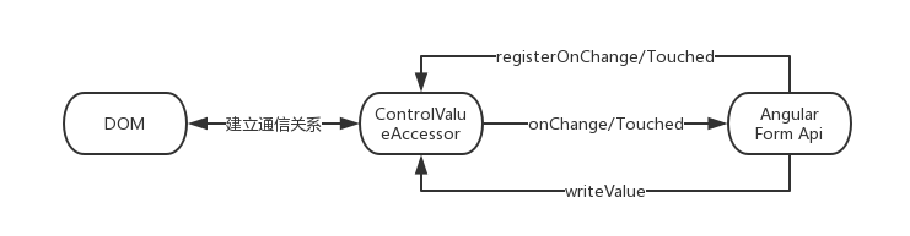

::: tip
在上篇文章[Angular 自定义表单组件](./customize-form-component.md)中，我们知道了只需要提供 `NG_VALUE_ACCESSOR` 令牌并实现`ControlValueAccessor` 接口，就可以让我们的组件有了表单的各种能力。

首先，我们来思考两个问题：

- 是谁给我们的自定义组件提供了表单的各种能力？
- 与之搭配使用的 `ngModel formControl formControlName` 是什么？

带着这两个问题，我们接着往下看
:::

<!-- more -->

## `ControlValueAccessor` 是什么

我们先来看看它的[源码定义](https://github.com/angular/angular/blob/master/packages/forms/src/directives/control_value_accessor.ts)。

```ts
/**
 * @description
 * Defines an interface that acts as a bridge between the Angular forms API and a
 * native element in the DOM.
 *
 * Implement this interface to create a custom form control directive
 * that integrates with Angular forms.
 *
 * @see DefaultValueAccessor
 *
 * @publicApi
 */
export interface ControlValueAccessor {
  writeValue(obj: any): void
  registerOnChange(fn: any): void
  registerOnTouched(fn: any): void
  setDisabledState?(isDisabled: boolean): void
}
```

从 `description` 中我们得到了一个很重要的信息，它是作为 Angular 表单 API 和 DOM 中的原生元素之间的桥梁。我们大概可以得到这样一个模型。



查看[官方文档](https://www.angular.cn/api/forms/ControlValueAccessor#controlvalueaccessor)可以得知 Angular 针对不同的原生表单元素总共内置了以下 7 种实现：

|        ControlValueAccessor        |   Native Form DOM    |
| :--------------------------------: | :------------------: |
|    CheckboxControlValueAccessor    | input[type=checkbox] |
|        DefaultValueAccessor        |    input,textarea    |
|        NumberValueAccessor         |  input[type=number]  |
|     RadioControlValueAccessor      |  input[type=radio]   |
|         RangeValueAccessor         |  input[type=range]   |
|     SelectControlValueAccessor     |        select        |
| SelectMultipleControlValueAccessor |   select[multiple]   |

如果我们去查看它们的源码实现，可以发现与我们上篇文章中实现的 `MyInput2` 组件都是大同小异。

- 使用 `writeValue` 方法来回填 DOM 元素的值
- 定义 `onChange` 方法，在 `registerOnChange` 中赋值，绑定 DOM 元素值变化的事件(`input`)。
- 定义 `onTouched` 方法，在 `registerTouched` 中赋值，绑定 DOM 元素失焦事件(`blur`)。

另外通过它们的 `selector` 我们可以发现一些蛛丝马迹。例如：[`CheckboxControlValueAccessor`](https://github.com/angular/angular/blob/master/packages/forms/src/directives/checkbox_value_accessor.ts#L43)

```ts
selector:
      'input[type=checkbox][formControlName],input[type=checkbox][formControl],input[type=checkbox][ngModel]',
```

它的 `selector` 是 DOM + `[formControlName]`/`[formControl]`/`[ngModel]`，这似乎和我们的 `my-input[formControl]` 和 `my-input[ngModel]` 的使用方式也是一样的？

## `FormControl` & `NgModel` & `FormControlName`

我们先来看看 Angular 对三者的定义。

```ts
/**
 * @description
 * * Syncs a standalone `FormControl` instance to a form control element.
 */
@Directive({ selector: '[formControl]' })
export class FormControlDirective extends NgControl implements OnChanges {
  @Input('formControl') form!: FormControl
}

/**
 * @description
 * Creates a `FormControl` instance from a domain model and binds it
 * to a form control element.
 */
@Directive({ selector: '[ngModel]:not([formControlName]):not([formControl])' })
export class NgModel extends NgControl implements OnChanges, OnDestroy {
  public readonly control: FormControl = new FormControl()
}

/**
 * @description
 * Syncs a `FormControl` in an existing `FormGroup` to a form control
 * element by name.
 */
@Directive({ selector: '[formControlName]' })
export class FormControlName extends NgControl implements OnChanges, OnDestroy {
  readonly control!: FormControl
}
```

可以发现正是这三个指令将 `FormControl` 对象和表单元素进行关联，受于篇幅限制，本文只为你介绍 `FormControlDirective`,另外两个指令也是大同小异。

### `FormControlDirective` 核心源码解读

```ts
export class FormControlDirective extends NgControl implements OnChanges {
  @Input('formControl') form!: FormControl

  constructor(
    @Optional() @Self() @Inject(NG_VALIDATORS) validators: Array<Validator | ValidatorFn>,
    @Optional() @Self() @Inject(NG_VALUE_ACCESSOR) valueAccessors: ControlValueAccessor[],
  ) {
    super()
    this._rawValidators = validators || []
    this.valueAccessor = selectValueAccessor(this, valueAccessors)
  }

  ngOnChanges(changes: SimpleChanges): void {
    if (this._isControlChanged(changes)) {
      setUpControl(this.form, this)
      if (this.control.disabled && this.valueAccessor!.setDisabledState) {
        this.valueAccessor!.setDisabledState!(true)
      }
      this.form.updateValueAndValidity({ emitEvent: false })
    }
  }
}
```

我们发现 `FormControlDirective` 注入了 `NG_VALIDATORS` 以及 `NG_VALUE_ACCESSOR` 令牌，这也是为什么我们需要在自定义的表单组件中提供这两个令牌。
`validators` 被简单的赋值给了该指令的 `_rawValidators`, 执行 `selectValueAccessor(this, valueAccessors)` ，选择最合适的 `ControlValueAccessor` 赋值给该指令的 `valueAccessor`。

```ts
export function selectValueAccessor(
  dir: NgControl,
  valueAccessors: ControlValueAccessor[],
): ControlValueAccessor | null {
  let defaultAccessor: ControlValueAccessor | undefined = undefined
  let builtinAccessor: ControlValueAccessor | undefined = undefined
  let customAccessor: ControlValueAccessor | undefined = undefined

  valueAccessors.forEach((v: ControlValueAccessor) => {
    if (v.constructor === DefaultValueAccessor) {
      defaultAccessor = v
    } else if (isBuiltInAccessor(v)) {
      builtinAccessor = v
    } else {
      customAccessor = v
    }
  })

  if (customAccessor) return customAccessor
  if (builtinAccessor) return builtinAccessor
  if (defaultAccessor) return defaultAccessor
}
```

其中 `isBuiltInAccessor` 是值除 default 外其他的 6 种内置 Accessor，不难看出，select 的规则是： 自定义 > 6 种内置 Accessor > default。
也就是说，当我们的自定义组件提供了 `NG_VALUE_ACCESSOR` 令牌， 那么在 `FormControlDirective` 中的 `valueAccessor` 就是我们的自定义组件对象实例。

在 `ngOnChanges` 的生命周期钩子函数种，如果是 `FormControl` 发生了改变，就执行 `setUpControl(this.form, this)` 。然后判断是否禁用，调用回调。最后更新 `FormControl` 的值和验证状态。

```ts
export function setUpControl(control: FormControl, dir: NgControl): void {
  dir.valueAccessor!.writeValue(control.value)

  setUpViewChangePipeline(control, dir)
  setUpModelChangePipeline(control, dir)

  setUpBlurPipeline(control, dir)

  if (dir.valueAccessor!.setDisabledState) {
    control.registerOnDisabledChange((isDisabled: boolean) => {
      dir.valueAccessor!.setDisabledState!(isDisabled)
    })
  }
}
```

在 `setUpControl` 中,去触发 `writeValue` 以及注册各个事件回调。

- 调用 `valueAccessor.writeValue(control.value)` 回写新的值
- 调用 `setUpViewChangePipeline(control, dir)` 注册 `valueAccessor` 的 `onChang`

  ```ts
  function setUpViewChangePipeline(control: FormControl, dir: NgControl): void {
    dir.valueAccessor!.registerOnChange((newValue: any) => {
      control._pendingValue = newValue
      control._pendingChange = true
      control._pendingDirty = true

      if (control.updateOn === 'change') updateControl(control, dir)
    })
  }
  ```

  - 当我们在组件中调用 `onChange(value)` ,执行的就是这个函数种地回调。

- 调用 `setUpModelChangePipeline(control, dir)` 注册 `FormControl` 的 `onChang`

  ```ts
  function setUpModelChangePipeline(control: FormControl, dir: NgControl): void {
    control.registerOnChange((newValue: any, emitModelEvent: boolean) => {
      // control -> view
      dir.valueAccessor!.writeValue(newValue)

      // control -> ngModel
      if (emitModelEvent) dir.viewToModelUpdate(newValue)
    })
  }
  ```

  - 当我们在**父**组件中调用 `this.valueControl.setValue('xxx')`, 执行的就是这个函数的回调。

- 调用 `setUpBlurPipeline(control, dir)` 注册 `valueAccessor` 的 `onTouched`

  ```ts
  function setUpBlurPipeline(control: FormControl, dir: NgControl): void {
    dir.valueAccessor!.registerOnTouched(() => {
      control._pendingTouched = true

      if (control.updateOn === 'blur' && control._pendingChange) updateControl(control, dir)
      if (control.updateOn !== 'submit') control.markAsTouched()
    })
  }
  ```

  - 当我们在组件中调用 `onTouched`, 执行的就是这个函数的回调。

- 最后判断 `valueAccessor.setDisabledState` 是否存在，来注册 `FormControl` 的 `onDisabledChange`
  - 当我们调用 `this.valueControl.disable()` 或者在 `template` 中绑定 `disabled=true` 时，就会触发这个回调，从而执行 `valueAccessor.setDisabledState(isDisabled)`

## 总结

现在我们来回答前面的两个问题：

`ngModel formControl formControlName` 都是关联 DOM 元素(Native Form 和 自定义表单组件) 和 Angular Form API(FormControl) 的指令。

- 注入 `NG_VALUE_ACCESSOR` 令牌获取到组件的实例对象。
- 注入 `NG_VALIDATORS` 令牌获取到组件的实例对象或者校验方法。
- 通过调用该实例的方法或校验方法，以及注册各个事件的回调，与 `FormControl` 进行交互，从而获得相应的能力。

注 1：`_rawValidators` 与 `FormControl` 的交互也是在 [`setUpControl`](https://github.com/angular/angular/blob/master/packages/forms/src/directives/shared.ts#L35) 函数中。

注 2： 默认的 CSS class 映射是通过 [`NgControlStatus`指令](https://github.com/angular/angular/blob/master/packages/forms/src/directives/ng_control_status.ts#L62)获得。

有兴趣的同学可以自行了解。
