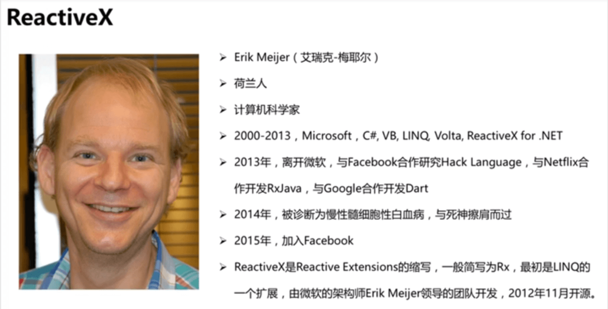
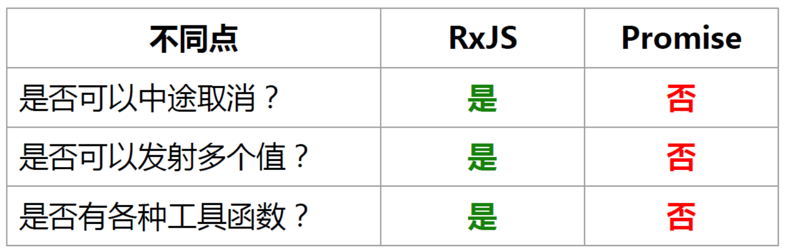

::: tip
在一个多月的学习使用过程中，觉得 RxJS 是个好东西，这是我的一个学习分享。
:::

<!-- more -->

## 什么是 RxJS

RxJS 是 Reactive Extension 这种模式的 JavaScript 语⾔实现

### 什么是 Rx

[ReactiveX.io](http://reactivex.io/)：Rx 是一个使用可观察数据流进行异步编程的编程接口，它结合了观察者模式、迭代器模式和函数式编程的精华

[维基百科](https://en.wikipedia.org/wiki/Reactive_extensions)：在软件编程中，Reactive Extensions 是一组工具，允许命令式编程语言对数据序列进行操作，而不管数据是同步还是异步。它提供了一组序列运算符，用于对序列中的每个项目进行操作

### Rx 发展历史

最初是 LINQ 的一个扩展，由微软的架构师 Erik Meijer 领导的团队开发，在 2012 年 11 月开源，Rx 是一个编程模型，目标是提供一致的编程接口，帮助开发者更方便的处理异步数据流，Rx 库支持.NET、JavaScript 和 C++，Rx 近几年越来越流行了，现在已经支持几乎全部的流行编程语言了，Rx 的大部分语言库由 ReactiveX 这个组织负责维护，比较流行的有 RxJava/RxJS/Rx.NET，社区网站是 reactivex.io。



## RxJS 能干什么

我们学习和应⽤ RxJS,是因为它的确能够帮助我们解决问题，⽽且这些问题长期以来⼀直在困扰我们，没有好的解决办法，这些问题包括：

- 如何控制⼤量代码的复杂度
- 如何保持代码可读
- 如何处理异步操作

### 举个栗子

实现： 当用户在一定时间内停止输入后，自动发起请求进行搜索（输入前后内容未发生变化就不要发起请求）

```html
<input type="text" id="demo" />
```

**原生 JS 实现**方式

```js
var $input = document.getElementById('demo') // 获取 Dom 元素
var myCallback = debounce(callback) // 获取 debounce 方法
//var myCallback = debounce(callback, 100);
$input.onkeyup = function(e) {
  //给 Dom 元素绑定事件
  var value = $input.value
  // 模拟请求
  setTimeout(function() {
    myCallback('这个是服务器返回的数据：' + value)
  }, 1000)
}

/**
 * 返回 fn 函数的防反跳版本, 将延迟函数的执行在函数最后一次调用时刻的 t 毫秒之后
 * @param fn 需要进行防反跳处理的函数
 * @param t 防抖时间 默认1s
 */
function debounce(fn, t) {
  var t = t || 1000,
    timer
  return function() {
    var _this = this,
      args = arguments
    if (timer) {
      clearTimeout(timer)
    }
    timer = setTimeout(function() {
      timer = null
      fn.apply(_this, args)
    }, t)
  }
}

var count = 0, // 记录返回次数
  beforeValue = $input.value // 保存上一次用户输入结果 用于对比
/**
 * 用户输入后回调函数
 * @param value
 */
function callback(value) {
  if (value === beforeValue) {
    return
  }
  count++
  beforeValue = value
  console.log('count: ' + count + ' , value: ' + value)
}
```

**Rxjs 实现**方式

```js
var $input = document.getElementById('demo') // 获取 Dom 元素
// 创建 Observable 对象
var observable = Rx.Observable.fromEvent($input, 'keyup')
  .map(e => e.target.value)
  .debounceTime(1000) //100
  .distinctUntilChanged()
  .switchMap(value => {
    return Rx.Observable.of('这个是服务器返回的数据：' + value).delay(1000)
  })
  .scan(
    (acc, one) => {
      return {
        value: one,
        count: acc.count + 1,
      }
    },
    { count: 0 },
  )
// 订阅 Observable
var subscription = observable.subscribe(callback.bind(this))

function callback(result) {
  console.log('count: ' + result.count + ' , value: ' + result.value)
}
```

在 **原生 JS** 的实现中，我们的代码看起来就是⼀串指令的组合，代码量较大，存在不友好的变量（count,beforeValue），并且当我们把防跳反时间设置成 100 毫秒后（会发起多次请求），会把每一次的请求都返回，而我们只需要最后一次请求的结果，真实场景下，由于网络的不可靠性，最后返回的不一定是我们想要的结果。

在 **RxJS** 的代码中，代码是⼀个⼀个函数，每个函数只是对输⼊的参数做了响应，然后返回结果。即使你现在还看不懂 RxJS 的代码，但是只要通过⽐较，你应该能够感觉到 RxJS 代码更加清爽，维护起来也更为简单。

## RxJS vs Promise

废话不多说，先上结果


### 再来举个栗子

直接上代码

```js
//以下是Promise的写法
let promise = new Promise(resolve => {
  setTimeout(() => {
    resolve('---promise timeout---')
  }, 2000)
})
promise.then(value => console.log(value))

//以下是Observable的写法
let observable$ = new Rx.Observable(observer => {
  let timeout = setTimeout(() => {
    observer.next('---observable timeout---')
  }, 2000)
  return () => {
    clearTimeout(timeout)
  }
})
let subscription = observable$.subscribe(value => console.log(value))

//1：Observable是可以中途取消的，而Promise一旦触发就不能取消了
setTimeout(() => {
  console.log('---observable 还没到执行时间, 我就把它取消了.---')
  subscription.unsubscribe()
}, 1000)

//2：Observable可以持续发射很多值，而Promise只能发射一个值就结束了
let observable2$ = new Rx.Observable(observer => {
  let count = 0
  let interval = setInterval(() => {
    observer.next(++count)
  }, 3000)
  return () => {
    clearInterval(interval)
  }
})

let subscription1 = observable2$.subscribe(value => console.log('Observable>' + value))

setTimeout(() => {
  console.log('---Observable unsubscribe---')
  subscription1.unsubscribe()
}, 10000)

//3：Observable提供了很多的工具函数，最最最常用的filter和map演示如下
let subscription2 = observable2$
  .filter(value => value % 2 == 0)
  .subscribe(value => console.log('filter>' + value))

let subscription3 = observable2$
  .map(value => value * value)
  .subscribe(value => console.log('map>' + value))

setTimeout(() => {
  console.log('---filter unsubscribe---')
  subscription2.unsubscribe()
}, 20000)

setTimeout(() => {
  console.log('---map unsubscribe---')
  subscription3.unsubscribe()
}, 30000)

console.log('------他们都是异步的 所以我先跑路了------')
```

## 实现一个属于你的 Observable

**Observable** 就是一个函数，他接受一个 **observer** 并且返回一个函数

- 函数体
  - 接收一个 observer(观察者)参数: 一个拥有 next, error 以及 complete 方法的对象
  - 返回一个可取消执行的函数
- 作用
  - 连接 observer 到发布者(产生 value 的对象)，并且返回一个能够取消连接生产者的方法。
  - 实际上 observer 就是一个可以随时传入数据的的监听器（handler 处理函数）

### 基础实现

以下代码需要在[jsbin](https://jsbin.com/?html,js,output)中运行

```js
// 发布者
class Publish {
  constructor() {
    let i = 0
    this.limit = 10
    this._id = setInterval(() => this.emit(i++), 1000)
  }

  emit(n) {
    if (this.onNext) {
      this.onNext(n)
    }
    if (n === this.limit) {
      if (this.oncomplete) {
        this.onComplete()
      }
      this.destroy()
    }
  }

  destroy() {
    clearInterval(this._id)
  }
}

// 我们的 Observable
function MyObservable(observer) {
  const publish = new Publish()
  publish.onNext = value => observer.next(value)
  publish.onError = err => observer.error(err)
  publish.onComplete = () => observer.complete()
  return () => {
    publish.destroy()
  }
}

// 观察者
const myObserver = {
  next(x) {
    console.log(x)
  },
  error(err) {
    console.error(err)
  },
  complete() {
    console.log('done')
  },
}

// 订阅
const subscription = MyObservable(myObserver)

setTimeout(subscription, 8500)

// map的实现
function myMap(observer, fn) {
  return new MyObservable(
    (o => {
      const mapObserver = {
        next: x => o.next(fn(x)),
        error: err => o.error(err),
        complete: () => o.complete(),
      }
      return mapObserver
    })(observer),
  )
}

myMap(myObserver, x => 'map value: ' + x * 2)

// todo 如何实现链式操作 MyObservable(myObserver).map(x => "map value: " + x * 2)
```
