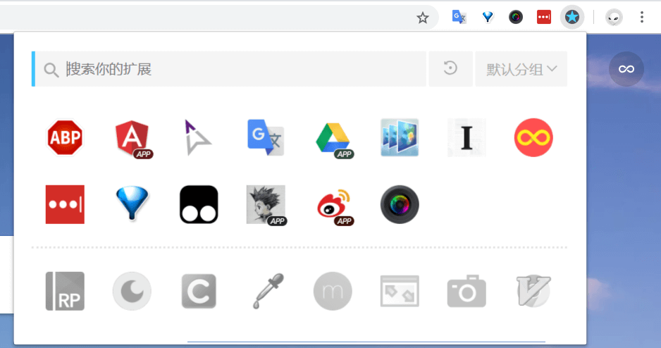
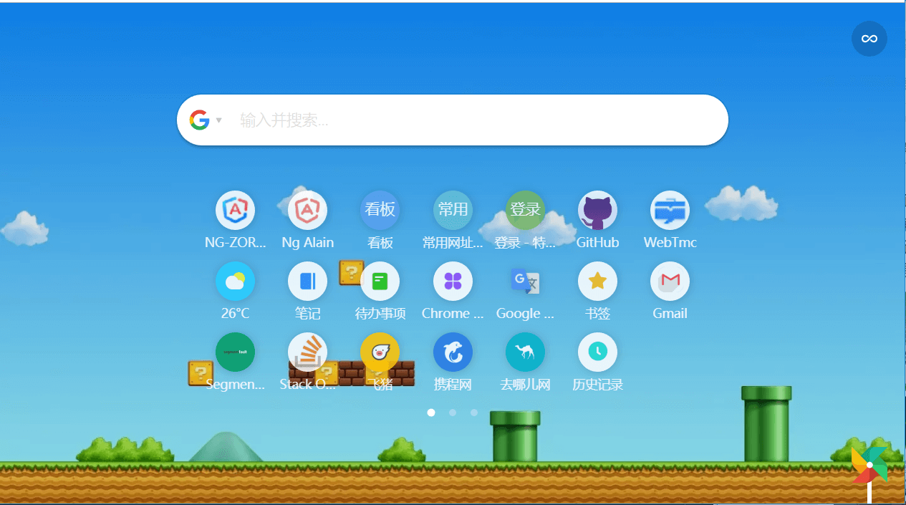
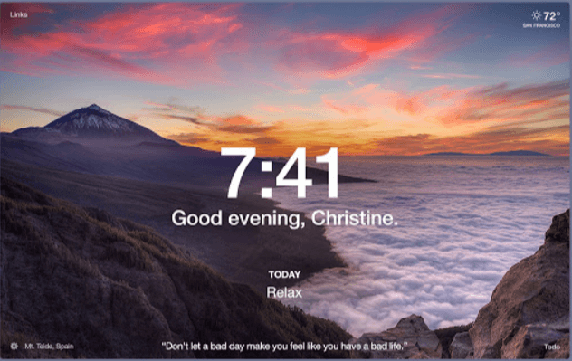
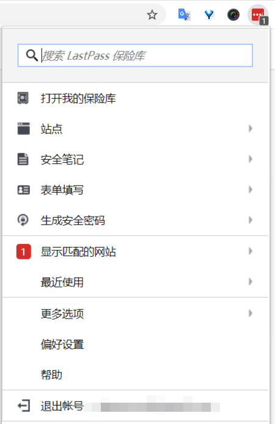
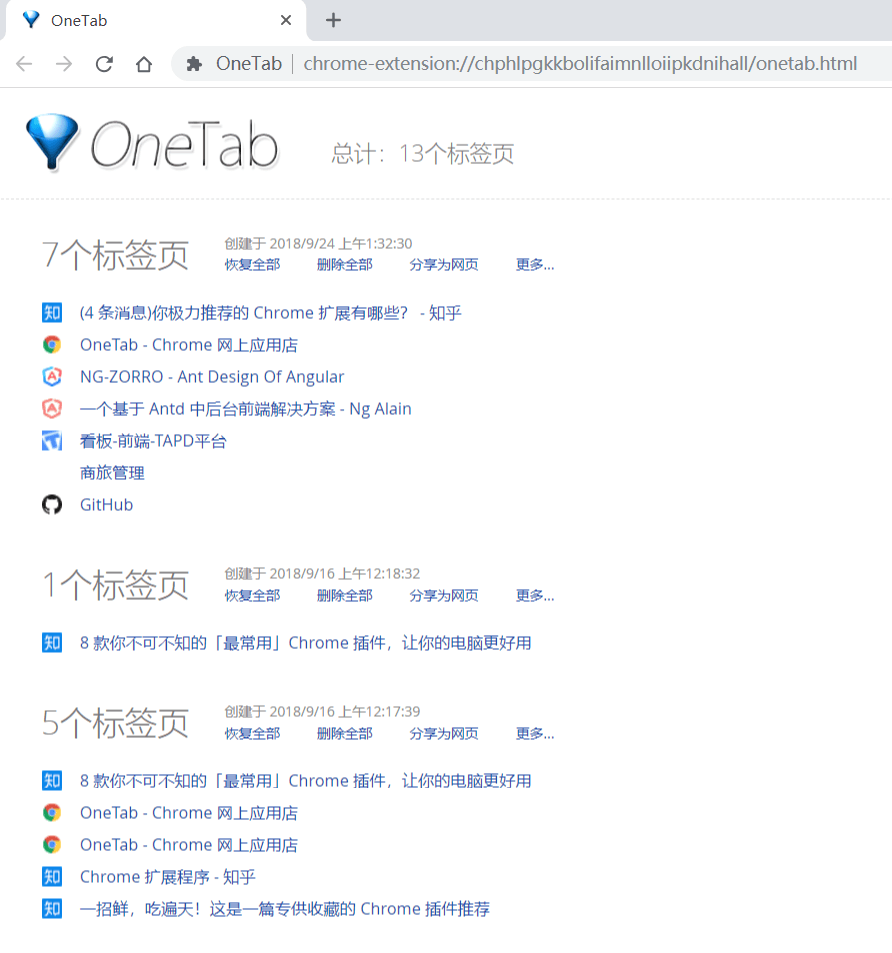
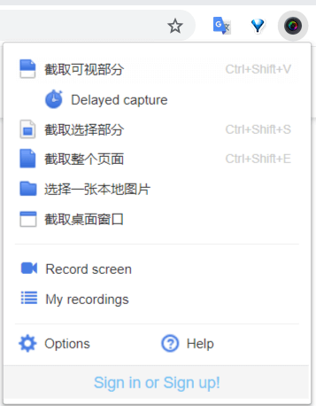
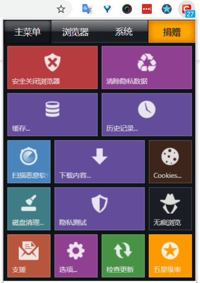

::: tip
一些常用且好用的扩展程序能够让你更加舒服的使用 Chrome, 尽情的让它火力全开吧。
:::

<!-- more -->

## 前言

大家都知道 Chrome 浏览器好用，可是它到底好用在哪呢？  
我觉得它跟系统的契合度不如 Windows 下的 Edge, macOS 下的 Safari. 启动速度也不如最新版的 Firefox, 它还极其吃内存。  
为什么大家却如此偏爱于它呢？

我猜可能是这样的吧：

- 对于程序猿来说：WOW，这个开发者工具太好用了，我就用它了。
- 对于其他人来说：哇，你看他们程序猿都用这个浏览器，肯定是最好用的。

其实，如果你只是单纯的用一个裸奔的 Chrome 的话，你大概只能发挥出它 30%的能力，这个时候你还不如用 Edge,Safari,Firefox 等，甚至国内的一些定制化的浏览器都会更好用一点。我之前一直都是日常上网用 Edge or Safari，开发调试用 Chrome。  
如果你是一个程序猿，用了 Chrome 的开发者工具，那么你大概能发挥它 5 成功力。  
那么剩下的 5 成能力呢，就要通过它的各种各样的插件（扩展程序）来获取了。

## 我的扩展程序

经过了三天时间的反复挑选，一周多的实际使用后，我的插件库里留下了这些

总共 23 个（右上角有一个的管理插件的插件），除去 4 个 PWA 应用（图标中带 APP）,剩下了 19 款插件，日常启用 11 款。  
如果你有什么好用的插件也可以推荐给我，比如我现在很想要一个快速清理浏览器的插件。

注意: Chrome 真的很吃内存（Chrome: 我没有，我不是，别瞎说），我这么用的话，一启动就是 800M。所以建议大家根据自己的电脑配置以及日常使用频率，来启用/禁用这些插件。

## 扩展程序介绍

接下里我将会把我这些插件逐一介绍给大家，能够科学上网的同学可以直接点插件名称添加到 Chrome. 对于不能科学上网的同学，可以前往[crx4chrome](https://www.crx4chrome.com)、[chromecj](http://chromecj.com/)、[cnplugins](http://www.cnplugins.com/)等第三方网址下载。

### [Adblock Plus](https://chrome.google.com/webstore/detail/adblock-plus/cfhdojbkjhnklbpkdaibdccddilifddb)

- 推荐指数：❤️❤️❤️❤️❤️
- 用途：广告屏蔽
- 介绍：Chrome 上较好的广告插件没太多争议，Adblock 和 Adblock Plus 随便选一款就行了。

### [crxMouse Chrome™ 手势](https://chrome.google.com/webstore/detail/crxmouse-chrome-gestures/jlgkpaicikihijadgifklkbpdajbkhjo)

- 推荐指数：❤️❤️❤️❤️(win) ❤️❤️(mac)
- 用途：鼠标手势,超级拖曳,滚轮手势,摇杆手势,平滑滚动,标签页列表等
- 介绍：crxMouse Chrome™ 手势扩展程序为您带来触手可及的 Chrome 浏览器功能，通过解锁完全可自定义的鼠标手势、击键和鼠标快捷键来提高您的工作效率。
- 备注：windows 下比较好用，macOS/linux 下需要设置成双击呼出右键菜单，不然就用不了
- 官方示例[链接](https://crxmouse.com/zh-hans/)

### [扩展管理器（Extension Manager）](https://chrome.google.com/webstore/detail/extension-manager/gjldcdngmdknpinoemndlidpcabkggco)

- 推荐指数：❤️❤️❤️❤️
- 用途：管理插件库（就是上面那张图所示）
- 介绍：一键管理所有扩展，快速开启/禁用、批量闪电管理，智能排序，右键卸载、锁定、选项配置，角标提醒，大小布局随心配。快捷、简单、安全。
- 一键开启/禁用扩展
  - 闪电分组：根据场景快速开启/禁用扩展组（被锁定或主题类扩展除外）
  - 智能排序：可根据您的使用频率智能排序（默认根据名称排序）
  - 右键菜单：提供锁定、卸载、选项配置、主页、APP 运行等快捷功能
  - 智能搜索：通过关键字或词组快速找到需要的扩展
  - 角标提醒：实时显示扩展状态，用完后提醒重置，减少资源占用（被锁定或主题类扩展除外）

### [Google 翻译](https://chrome.google.com/webstore/detail/google-translate/aapbdbdomjkkjkaonfhkkikfgjllcleb)

- 推荐指数：❤️❤️❤️
- 不仅能翻译单词/语句，还能翻译整个网页，英语不好的同学的福音。（只给 3 星的原因是它翻译的太好了，让我很依赖 TAT）

### [Imagus](https://chrome.google.com/webstore/detail/imagus/immpkjjlgappgfkkfieppnmlhakdmaab?utm_source=chrome-ntp-icon)

- 推荐指数：❤️❤️❤️❤️
- 用途：鼠标悬停预览图片或内容
- 介绍：鼠标指针悬停在链接或缩略图上时直接在当前页面的弹出视图上显示这些图片、HTML5 视频/音频和内容专辑。对于经常浏览多图片的网站的人来说是神器，从此看图不用一张张点开了，鼠标指上去就行。它额外还提供了很多自主化的功能设置。

- 愿袁老健康长寿

### [Instapaper](https://chrome.google.com/webstore/detail/instapaper/ldjkgaaoikpmhmkelcgkgacicjfbofhh)

- 推荐指数：❤️❤️
- 用途：保存离线阅读/稍后阅读的链接
- 介绍：可以在你的 iPhone、iPad、Android、电脑或 Kindle 上保存网页。登录账户后，可以跨终端进行阅读，简化的操作流程，无需多重跳转步骤。

### [Infinity 新标签页(Pro)](https://chrome.google.com/webstore/detail/infinity-new-tab-pro/nnnkddnnlpamobajfibfdgfnbcnkgngh)

- 推荐指数：❤️❤️❤️❤️
- 用途：自定义新标签页
- 介绍：Infinity 新标签页是一款基于 html5 的扩展程序，它将开启你的 Chrome 新标签页和火狐新标签页高度自定义时代。一步添加常用网站到新标签页并以图标展示，可定制的搜索引擎，精选高清壁纸，还有天气、笔记、书签、待办事项、历史记录、Gmail 提醒等小挂件帮助提高生产力。
- 备注：Pro 暂时是免费的，但是后面可能会收费，有相应的永久免费版 [Infinity](https://chrome.google.com/webstore/detail/infinity-new-tabproductiv/dbfmnekepjoapopniengjbcpnbljalfg) 功能上会阉割一些

### [Momentum](https://chrome.google.com/webstore/detail/momentum/laookkfknpbbblfpciffpaejjkokdgca)

- 推荐指数：❤️❤️❤️
- 用途：新标签页
- 介绍：如果你觉得上面的 Infinity 太过臃肿，你只是想要一个漂亮的标签页的话，那么推荐你用这个。更加简约，图片质量也更高。

### [LastPass: Free Password Manager](https://chrome.google.com/webstore/detail/lastpass-free-password-ma/hdokiejnpimakedhajhdlcegeplioahd)

- 推荐指数：❤️❤️❤️❤️
- 用途：密码管理器
- 介绍：我们有那么多的账号密码，如果都设置成一个密码的话，只要其中一个账号被盗了，那么所有的账号就都会受到威胁。而设置成不同的密码的话...我只能说：你开心就好。
- 备注 1：关于使用 LastPass 还是 1Password 知乎上有个[1Password 和 LastPass 该选哪个？](https://www.zhihu.com/question/38273008)，可以参考一下，出于钱包的考虑，我选择了 LastPass，Free！Free！Free！
- 备注 2：目前 Chrome 自身的密码管理也越来越强大了，尤其是最新的版本里添加了密码生成器。 emmmm,等等，我们在墙内，还是算了吧，万一哪天不能科学上网了就 GG 了。

### [OneTab](https://chrome.google.com/webstore/detail/onetab/chphlpgkkbolifaimnlloiipkdnihall)

- 推荐指数：❤️❤️❤️
- 用途：合并标签页
- 介绍：当您发现自己有太多的标签页时，单击 OneTab 图标，将所有标签页转换成一个列表。当您需要再次访问这些标签页时，可以单独或全部恢复它们。当您的标签页位于 OneTab 列表时，您将节省高达 95％的内存，因为你将减少 Google Chrome 浏览器中打开的标签页的数量。

### [Tampermonkey](https://chrome.google.com/webstore/detail/tampermonkey/dhdgffkkebhmkfjojejmpbldmpobfkfo)

- 推荐指数：❤️❤️❤️❤️❤️
- 用途：通过安装各类脚本对网站进行定制
- 介绍：emmmmm,这个插件基本上是必备的了，随便搜一下就能搜到一堆攻略。
  - 直接下载百度网盘文件
  - 重新定制繁杂的微博页面
  - 去掉视频播放广告
  - 将网站默认的「二维码登录」改回「账号密码登录」
  - 绕过搜索引擎的跳转提示
  - 还原清新的小说阅读模式
  - 豆瓣和 IMDb 互相显示评分
  - ……
- 使用攻略之一[用 Chrome 的人都需要知道的「神器」扩展](https://sspai.com/post/40485)

### [网页截图:注释&录屏](https://chrome.google.com/webstore/detail/awesome-screenshot-screen/nlipoenfbbikpbjkfpfillcgkoblgpmj)

- 推荐指数：❤️❤️❤️
- 用途：截图 录屏
- 介绍：录屏，捕获整个页面或任何部分，矩形，圆形，箭头，线条和文字，模糊敏感信息，一键上传分享注释。支持 PNG 和链接

### [Click&Clean](https://chrome.google.com/webstore/detail/clickclean/ghgabhipcejejjmhhchfonmamedcbeod)

- 推荐指数：❤️❤️
- 用途：浏览器清理及尝试系统程序入口
- 介绍：功能很强大很多，但是我觉得有点过于多了，我只想要一个能够快速清理浏览器的插件，找了几个都不是很好用，将就着用这个了。

### [Search by Image (by Google)](https://chrome.google.com/webstore/detail/search-by-image-by-google/dajedkncpodkggklbegccjpmnglmnflm)

- 推荐指数：❤️❤️
- 用途：搜索图片
- 介绍：添加一个右键菜单，使用 web 上的任何图像启动 Google 搜索，由谷歌图片团队提供，所以只有能科学上网的同学才能用。

### [Vimium](https://chrome.google.com/webstore/detail/vimium/dbepggeogbaibhgnhhndojpepiihcmeb)

- 推荐指数：❤️❤️
- 用途：抛弃鼠标 纯键盘控制 Chrome
- 介绍：上手难度较大（至少我玩了一会儿就把它丢进小黑屋了），比较适合长期使用 Vim 的选手，用习惯了很炫酷，很装逼。
- 教程：[神器 vimium：比同级程序员成长更快，我主要靠它](https://zhuanlan.zhihu.com/p/38179086)

## 专业/职业相关

### [Axure RP Extension for Chrome](https://chrome.google.com/webstore/detail/axure-rp-extension-for-ch/dogkpdfcklifaemcdfbildhcofnopogp)

- 用途：查看 Axure 交互稿
- 介绍：这个是工作需求，用到了自然就必须得装了。

### [Augury](https://chrome.google.com/webstore/detail/augury/elgalmkoelokbchhkhacckoklkejnhcd)

- 用途：Angular 开发者工具
- 介绍：用于在运行时调试和可视化 Angular 应用程序。
- 用法：[Angular Debugger 调试](https://juejin.im/entry/5a4ce4965188252a3d38659a)

### [Eye Dropper](https://chrome.google.com/webstore/detail/eye-dropper/hmdcmlfkchdmnmnmheododdhjedfccka)

- 用途：颜色选择器
- 介绍：前端和 UI 在抓取网页上的颜色时候需要用到。

### [Resolution Test](https://chrome.google.com/webstore/detail/resolution-test/idhfcdbheobinplaamokffboaccidbal)

- 用途：调整分辨率
- 介绍：可以在不同的屏幕分辨率下测试 web 页面，并可以选择定义自己的分辨率，做兼容性测试时候需要用到。
