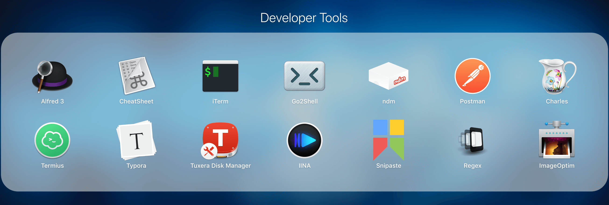
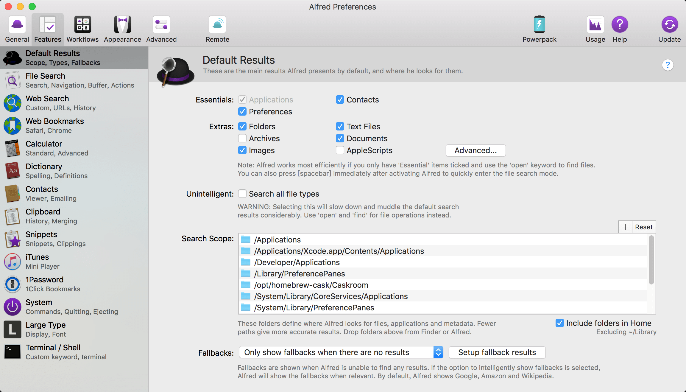
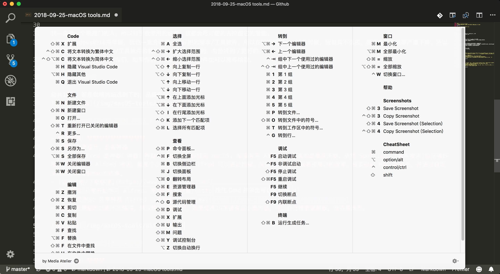
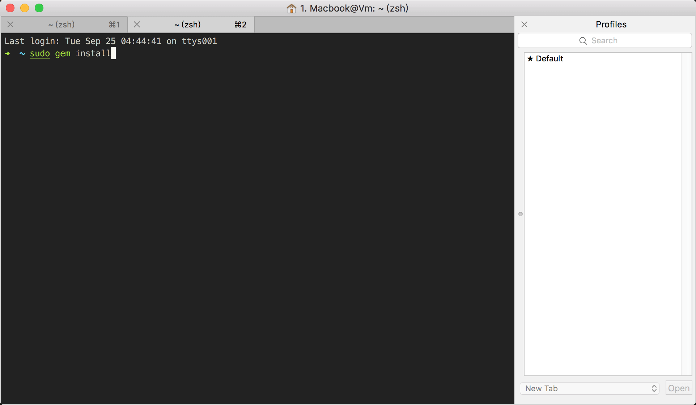
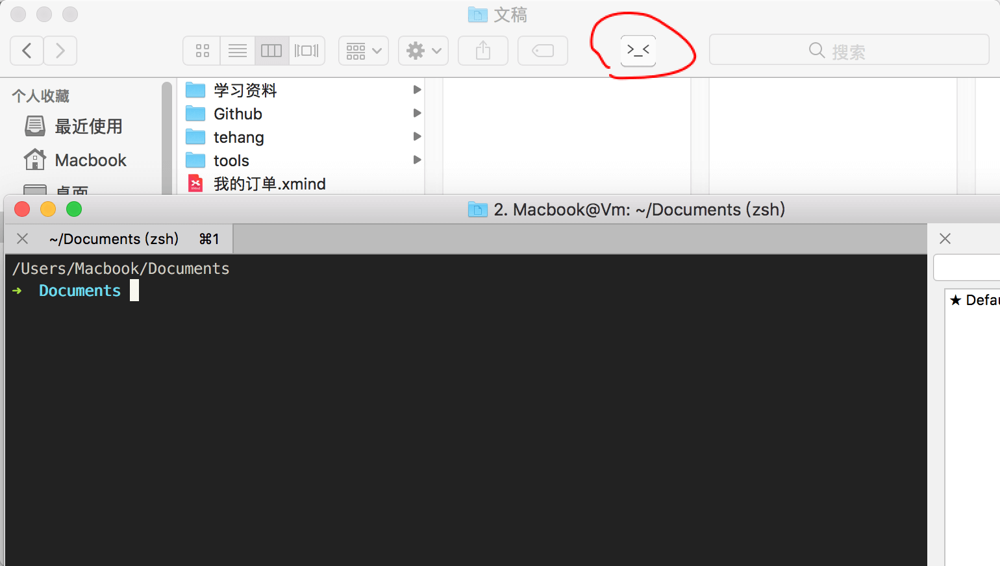
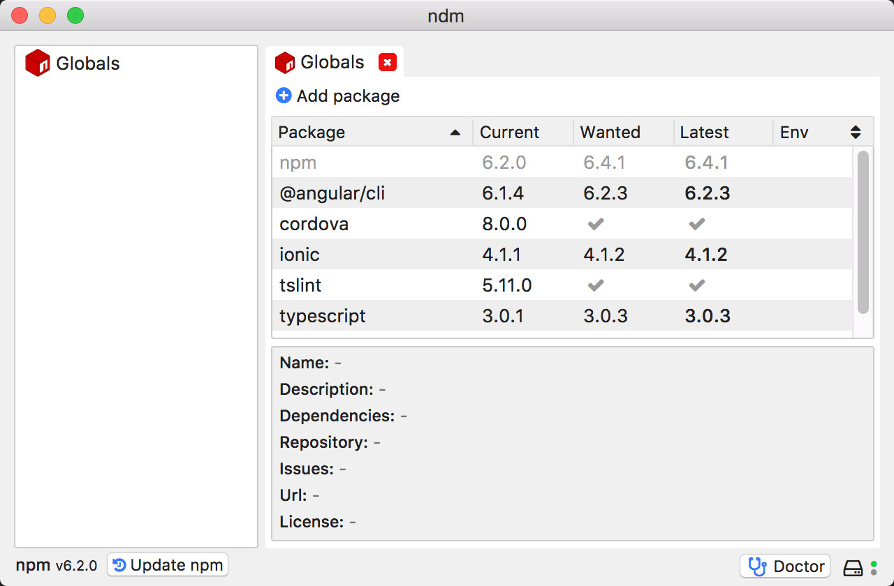
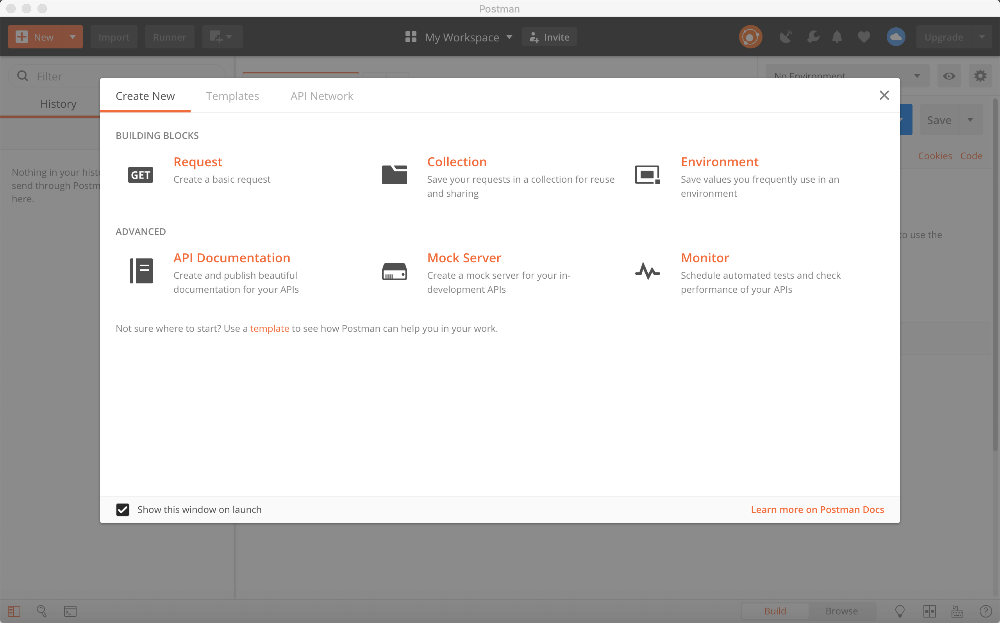
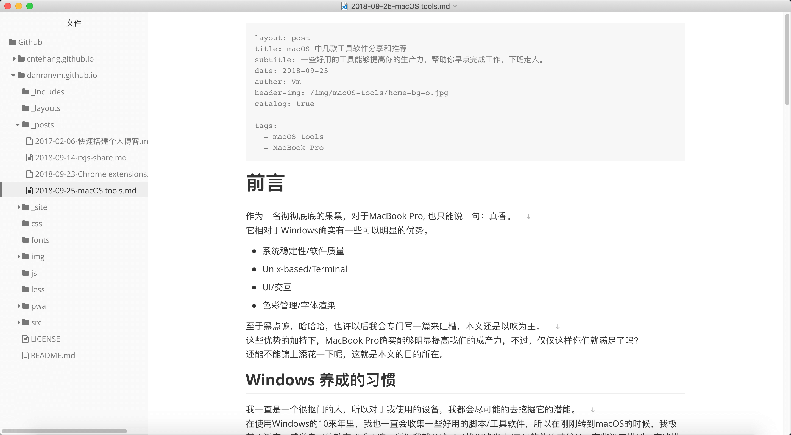
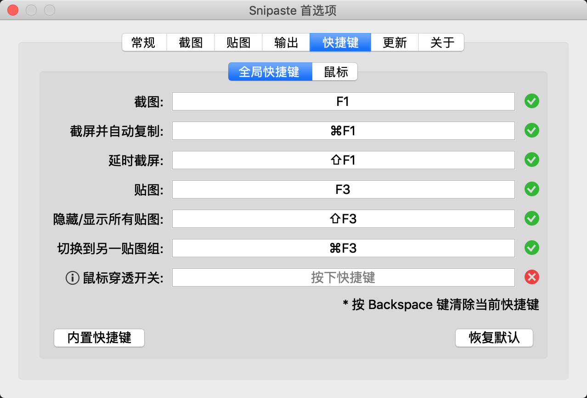
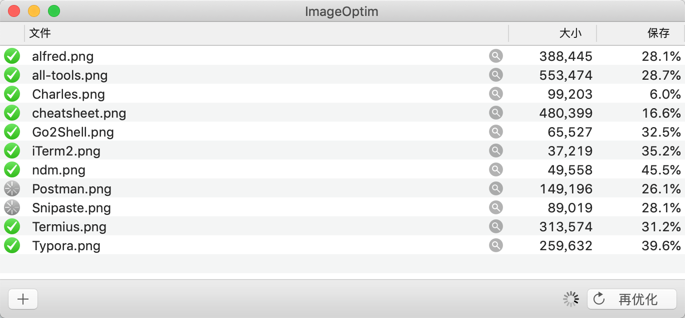

::: tip
一些好用的工具能够提高你的生产力，帮助你早点完成工作，下班走人。
:::

<!-- more -->

## 前言

作为一名彻彻底底的果黑，对于 MacBook Pro, 也只能说一句：真香。  
它相对于 Windows 确实有一些可以明显的优势。

- 系统稳定性/软件质量
- Unix-based/Terminal
- UI/交互
- 色彩管理/字体渲染

至于黑点嘛，哈哈哈，也许以后我会专门写一篇来吐槽，本文还是以吹为主。  
这些优势的加持下，MacBook Pro 确实能够明显提高我们的成产力，不过，仅仅这样你们就满足了吗？
还能不能锦上添花一下呢，这就是本文的目的所在。

## Windows 养成的习惯

我一直是一个很抠门的人，所以对于我使用的设备，我都会尽可能的去挖掘它的潜能。  
在使用 Windows 的 10 来年里，我也一直会收集一些好用的脚本/工具软件，所以在刚刚转到 macOS 的时候，我极其不适应，感觉自己的效率严重下降。所以我  就开始了寻找那些脚本/工具软件的替代品，有些没有找到，有些找到了更好的。  
接下来我将把它们分享给你们，如果你们有什么好的工具软件也可以推荐给我。

## 工具软件介绍

总共 14 款，都是我精挑细选剩下的，品质保障。

### [Alfred](https://www.alfredapp.com/)

- 推荐指数：❤️❤️❤️❤️❤️❤️(yes, it is 666)
- 用途：效率提升，必备神器
- 介绍： Alfred 是神器！神器！神器！我觉得如果你使用 macOS, 却没有用 Alfred, 那真的是暴殄天物。虽然 Spotlight (聚焦搜索)也足够好用，但是相比于 Alfred 来说，就是个小孩子玩具。 Alfred 可以通过热键，关键字，文本扩展等提高你的效率，搜索你的 Mac 和网络，并通过自定义操作提高控制 Mac 的效率。
- 使用教程[从零开始学习 Alfred：基础功能及设置](https://sspai.com/post/32979)
- 进阶教程[Mac 效率神器 Alfred 以及常用 Workflow](https://www.jianshu.com/p/0e78168da7ab)
- 备注：免费版的功能不太够用，建议购买完整版的，如果觉得 19 英镑有点小贵的话，可以自行搜索破解版，很容易找到。

### [CheatSheet](https://www.mediaatelier.com/CheatSheet/)

- 推荐指数：❤️❤️❤️
- 用途：帮你轻松找到快捷键
- 介绍： macOS 有太多太多的快捷键，想要全部记住几乎不可能， CheatSheet 做的事情很简单，就是在你使用任何软件的时候，长按 Command 键，即可显示当前软件的所有快捷键，就能快速地找到你想要的快捷键。另外，它还支持打印和 PDF 输出功能。
- 建议：只有当你遇到比较复杂并且经常重复操作的时候，再去查找和使用快捷键，而不是一上来就背一堆的快捷键。一来很多快捷键很少用到，二来快捷键记得越多就越容易混淆。经常使用的快捷键，很容易就形成肌肉记忆。

### [iTerm2](https://www.iterm2.com)

- 推荐指数：❤️❤️❤️❤️❤️
- 用途：代替 Terminal
- 介绍：虽然 Terminal 相对 Windows 的 CMD 来说已经好用很多了，但是还是可以有不小的提升空间。
- 使用教程[最简单 iTerm2 + oh-my-zsh 打造 Mac 炫酷终端教程-菜鸟版实操整理](https://www.jianshu.com/p/53eb1075f627)

### [Go2Shell](http://zipzapmac.com/go2shell)

- 推荐指数：❤️❤️❤️❤️❤️
- 用途：弥补 finder 的坑
- 介绍：macOS 值得吐槽的一点就是它的 finder 太难用了，用了 Alfred + Go2Shell 后会稍微改善一点。
- 使用教程[关于 Go2Shell](https://www.jianshu.com/p/bae3a64ea762)
- 备注:图标很可爱有木有，哈哈哈

### [ndm](https://720kb.github.io/ndm/)

- 推荐指数：❤️❤️❤️
- 用途： npm 的桌面管理器
- 介绍：用图形化界面去管理你的 npm, 相对来说更加直观一些，也不容易误操作。

### [Postman](https://www.getpostman.com/)

- 推荐指数：❤️❤️❤️❤️
- 用途：HTTP 请求/接口测试
- 介绍：在我们平时开发中，特别是需要与接口打交道时，无论是写接口还是用接口，拿到接口后肯定都得提前测试一下，这样的话就非常需要有一个比较给力的 Http 请求模拟工具。
- 基本教程[Postman 工具使用方法详解(完)](https://meetes.top/2018/06/28/Postman%20%E5%B7%A5%E5%85%B7%E4%BD%BF%E7%94%A8%E6%96%B9%E6%B3%95%E8%AF%A6%E8%A7%A3/)
- 进阶教程[果冻想](https://www.jellythink.com/archives/category/tool-tutorials/postman)

### [Charles](https://www.charlesproxy.com/)

- 推荐指数：❤️❤️❤️❤️
- 用途：网络请求截取/代理
- 介绍：Charles 是在 PC 端常用的网络封包截取工具，在做移动开发时，我们为了调试与服务器端的网络通讯协议，常常需要截取网络封包来分析。除了在做移动开发中调试端口外，Charles 也可以用于分析第三方应用的通讯协议。配合 Charles 的 SSL 功能，Charles 还可以分析 Https 协议。Charles 通过将自己设置成系统的网络访问代理服务器，使得所有的网络访问请求都通过它来完成，从而实现了网络封包的截取和分析。
- 使用教程[Charles 功能介绍和使用教程](https://juejin.im/post/5b8350b96fb9a019d9246c4c)

### [Termius](https://www.termius.com/)

- 推荐指数：❤️❤️❤️
- 用途：SSH 管理的客户端
- 介绍：优点就是可以跨平台
- 使用教程[termius 怎么使用](https://www.jb51.net/softjc/594388.html)

### [Typora](https://typora.io/)

- 推荐指数：❤️❤️❤️
- 用途：读写 markdown 文件
- 介绍：超级轻量+实时预览+跨平台，UI 也简洁

### [Tuxera NTFS for Mac](https://www.tuxera.com/products/tuxera-ntfs-for-mac/)

- 推荐指数：❤️❤️❤️❤️
- 用途：读写 NTFS 文件
- 介绍：除非你彻底抛弃 Windows, 并且拒绝与 Windows 用户打交道，不然还是乖乖装一个吧。

### [IINA](https://github.com/lhc70000/iina/releases)

- 推荐指数：❤️❤️❤️
- 用途：视频播放器
- 介绍：基于最优秀的开源播放器之一 mpv，IINA 支持几乎所有常用媒体的播放（甚至是 GIF），并得以稳定输出高质量的图像。MPV 的配置文件和脚本系统仍然保留。不过目前还没有发布正式版（不过快了），官网下载的还是比较老的版本，建议去 Github 仓库去下载，也就是我给的这个[链接](https://github.com/lhc70000/iina/releases)

### [Snipaste](https://zh.snipaste.com/)

- 推荐指数：❤️❤️❤️❤️
- 用途：截图+贴图
- 介绍：你还可以将剪贴板里的文字或者颜色信息转化为图片窗口，并且将它们进行缩放、旋转、翻转、设为半透明，甚至让鼠标能穿透它们！如果你是程序员、设计师，或者是大部分工作时间都在电脑前，贴图功能将改变你的工作方式、提升工作效率。

### [ImageOptim](https://imageoptim.com/)

- 推荐指数：❤️❤️❤️
- 用途：图片压缩工具
- 介绍：有时候图片太大了也不是一件什么好事，在传播的时候速度/流量都会受到限制，所以我们在有必要的时候就需要一个压缩工具，ImageOptim 压缩是无损的。另外推荐一个在线压缩的网站[Tinypng](https://tinypng.com/), 也同样好用，不过这个就不是无损的了。

